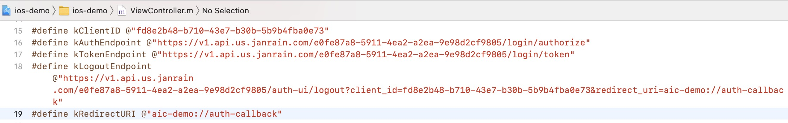

# Akamai Identity Cloud Hosted Login iOS super simple demo
This sample demonstrates how Akamai Identity Cloud should be integrated with iOS application.


<br>
<br>


# Prerequisites
- Basic hands-on experience of Akamai Identity Cloud Hosted Login
- Mac or Windows PC
- Postman
- Xcode
- Akamai Identity Cloud Hosted Login Instance

**You must contact Akamai CSA to deploy the instance.**
<br>
<br>


# OIDC Client Set-up
## Create Public Client
Create a OIDC Public Client with Postman. See the document here for reference.
https://identitydocs.akamai.com/home/configcustomer-idclients

Here comes a sample request body of the API endpoint.

```json
{
    "name": "Confidential Client Instance1",
    "redirectURIs": [
        "aic-demo://auth-callback"
    ],
    "loginPolicy": "0fabeaa7-6113-4ae2-8ffa-94884274db25",
    "tokenPolicy": "ecef069a-026a-4771-89ba-83514edfa81b",
    "type": "confidential"
}
```
## Open Xcode workspace
Go your terminal and open the workspace.
```terminal
$ open ios-demo.xcworkspace
```
## Modify ViewController.m
All you need to modify is just 4 parameters of OIDC. Find out the parameters that you should set on Janrian Console or Postman.

```swift
#define kClientID @"xxxx"
#define kAuthEndpoint @"https://v1.api.us.janrain.com/<customerID>/login/authorize"
#define kTokenEndpoint @"https://v1.api.us.janrain.com/<customerID>//login/token"
#define kLogoutEndpoint @"https://v1.api.us.janrain.com/<customerID>//auth-ui/logout?client_id=<clientID>&redirect_uri=aic-demo://auth-callback"
```



**You must contact Akamai CSA if you are not clear how you can find the parameters.**
<br>
<br>


# Build & Try
Select "ios-demo" on the top bar of Xcode, and set your favorit simulator.
<br>

<br>

Build & try
Push build button and try!
<br>

<br>
<br>


# Issue Reporting
If you have found a bug or if you have a feature request, please report them at this repository issues section. Please do not report security vulnerabilities on the public GitHub issue tracker.