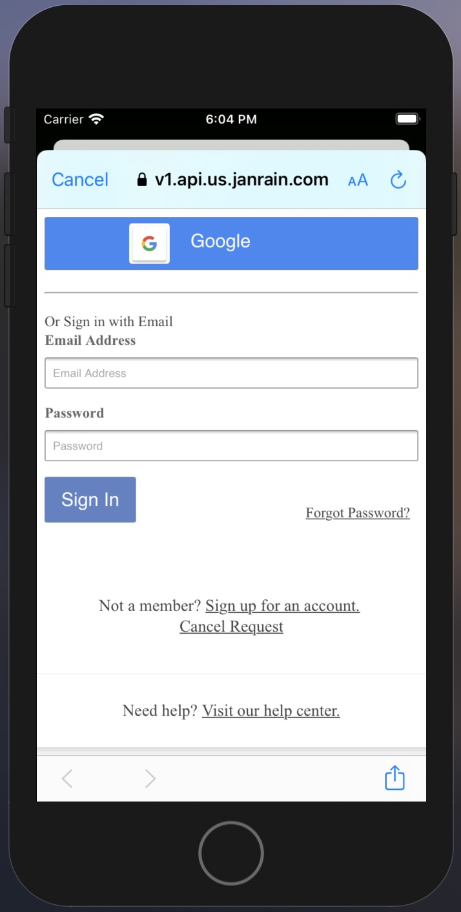

# Akamai Identity Cloud Hosted Login iOS サンプル
Akamai Identity Cloud Hosted Login iOSのサンプルです。
<div align="center">

</div>
<br>
<br>


# 前提条件
事前に下記をご準備頂きたくお願い致します。
- Mac Book
- Postman
- Xcode
- iTerm2
- Akamai Identity Cloud Hosted Loginインスタンス

**Hosted Loginのインスタンス払い出しはAkamaiの担当にコンタクト頂きたくお願い致します。**
<br>
<br>


# Hosted Login OIDC Clientのセットアップ
## Public Clientの作成
Postmanを利用してAkamai Identity CloudのAPIにリクエストを送信してPublic Clientを作成します。詳細は下記をご参照お願いします。
https://identitydocs.akamai.com/home/configcustomer-idclients

サンプルのリクエストパラメータです。こちらのサンプルでは"aic-demo://auth-callback"と言う名前のカスタムスキームを利用しているため、こちらのカスタムスキームをOAuthのRedirect URIとして指定しています。

```json
{
    "name": "Confidential Client Instance1",
    "redirectURIs": [
        "aic-demo://auth-callback"
    ],
    "loginPolicy": "0fabeaa7-6113-4ae2-8ffa-94884274db25",
    "tokenPolicy": "ecef069a-026a-4771-89ba-83514edfa81b",
    "type": "public"
}
```
<br>

## Xcodeの起動
iTerm2からXcodeを起動します。
```terminal
$ open ios-demo.xcworkspace
```
<br>

## ViewController.mの修正
必要な作業は4つの変数を修正するだけです。値はJanrian ConsoleもしくはPostmanで取得できます。

```swift
#define kClientID @"xxxx"
#define kAuthEndpoint @"https://v1.api.tk.janrain.com/<customerID>/login/authorize"
#define kTokenEndpoint @"https://v1.api.tk.janrain.com/<customerID>//login/token"
#define kLogoutEndpoint @"https://v1.api.tk.janrain.com/<customerID>//auth-ui/logout?client_id=<clientID>&redirect_uri=aic-demo://auth-callback"
```

kClientIDはJanrain Consoleの左ペイン"MANAGE PROPERTIES"->"該当のPublic Client"->"janrainOidcClientId"の設定値です。
<div align="center">

</div>
<br>

customerIDはJanrain Consoleの左ペイン"MANAGE APPLICATION"->"customer_id"の設定値です。
<div align="center">

</div>
<br>
<br>


# 動作テスト
Xcodeのトップバーで"ios-demo"を選択してお好きなSimulatorを選択します。
<div align="center">

</div>
<br>

ビルドボタンを押してSimulatorを起動します。
<div align="center">

</div>
<br>

Simulatorで"login"をクリックしてポップアップで"Continue"を押します。
<div align="center">

</div>
<br>

"Sign-up for an account"を押します。
<div align="center">

</div>
<br>

Email, Passwordを入力して"Create Account"を押します。
<div align="center">

</div>
<br>

Hosted Loginが払い出したTokenが表示されれば成功です。
<div align="center">

</div>